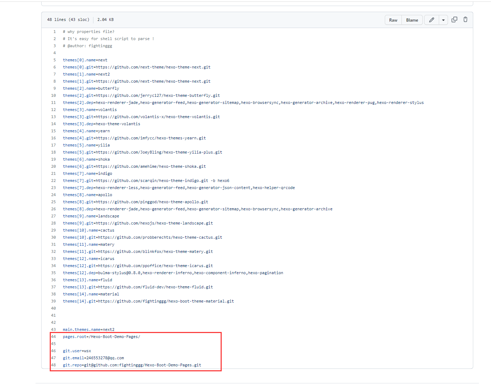

# 如何安装

## 1. 创建Blog源码
```
git clone https://github.com/fightinggg/Hexo-Boot-Demo.git
```

## 2. 推送到[GITHUB](https://github.com/)
和这个[项目](https://github.com/fightinggg/Hexo-Boot-Demo) 一样

<!-- more -->

## 3. 配置源码GITHUB设置
你需要配置
- DOCKERUSERNAME: Docker 用户名 (用来登录[Dockerhub](https://hub.docker.com/) 和下载镜像,你可以在[这里](https://hub.docker.com/signup)注册)
- DOCKERPASSWORD: Docker 密码
- HEXO_DEPLOY_PRI: 你自己的SSH密钥（用来推送博客）


## 4.创建GITHUB页面
和这个[项目](https://github.com/fightinggg/Hexo-Boot-Demo-Pages) 一样

## 5. 配置你的BLog源码
打开文件 `/themes-configs/config.properties`
编辑下面内容

- pages.root： 你博客的根目录，同时也是GITHUB 页面项目的名字
- git.user: 你的名字
- git.email: 你的邮箱
- git.repo: 你GITHUB页面项目的SSH地址




## 6. 需要配置更多的主题？
如果你想要更多的主题，编辑  themes.name themes.git and themes.dep
- themes[i].name: 主题名字
- themes[i].git: 主题地址
- themes[i].dep: 主题的依赖


## 7. 开心享受多主题Hexo播客吧
你现在会发现，你的博客源码项目的GITHUB ACTION已经运行起来了，马上你的GITHUB页面就会被部署
