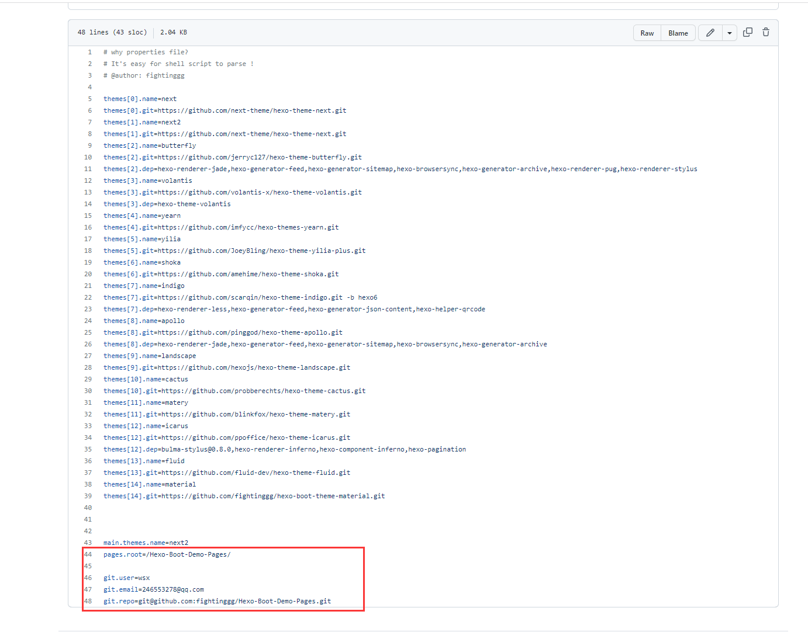

# How To Install

## 1. Create Your Blog Source Code Project
```
git clone https://github.com/fightinggg/Hexo-Boot-Demo.git
```

## 2. Push Your Project To [GITHUB](https://github.com/)
Just like This [Project](https://github.com/fightinggg/Hexo-Boot-Demo) 

## 3. Config Your GITHUB Settings
You Need To Config 
- DOCKERUSERNAME: Docker Username (For login [Dockerhub](https://hub.docker.com/) and pull Images, You can register on [here](https://hub.docker.com/signup))
- DOCKERPASSWORD: Docker Password
- HEXO_DEPLOY_PRI: Your SSH primary key


## 4. Create Your Blog Pages Project
Just like This [Project](https://github.com/fightinggg/Hexo-Boot-Demo-Pages) 

## 5. Config Your Blog Source Code
Open file `/themes-configs/config.properties`
Edit 

- pages.root： your blog root dir，and is the name of  Your Blogs Pages Project
- git.user: your name
- git.email: your email
- git.repo: your Blog Pages Project ssh git address




## 6. Need More Themes?
If you want to install more hexo themes, edit  themes.name themes.git and themes.dep
- themes[i].name: your theme's name
- themes[i].git: your theme's http git address
- themes[i].dep: your theme's depends


## 7. Enjoy Your Self
Now Your Can Find that , Your Blog Source Code Project's GITHUB Action is running... And Your Blog Is Deploy To Your Blog Pages Project


